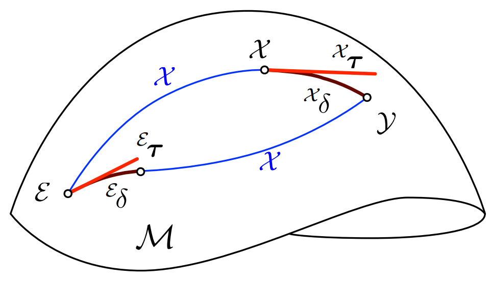

# **Adjoint**

{width="350"}
///caption
Adjoint Action [[1]](#ref1)
///
In Lie theory, tangent vectors at different points on the Lie group manifold $\mathcal{M}$ belong to different tangent spaces. 
To "transform" a tangent vector from one tangent space to another, we use the *adjoint action* do that transformation on Lie algebra. The adjoint action acts on the Lie algebra of the Lie group, rather than directly on the Lie group elements.
Mathematically, the adjoint action is denoted as :

$$
\mathsf{Adj}_g : \mathfrak{m} \to \mathfrak{m}, X \mapsto \mathsf{Adj}_g(X)=gXg^{-1}
$$

where $g \in \mathcal{M}$ is an element of Lie groups $\mathcal{M}$, and $X \in \mathfrak{m}$ is a element of Lie algebra of $\mathcal{M}$.

#### References 

<a id="ref1">[1] [A micro Lie theory for state estimation in robotics
](https://arxiv.org/pdf/1812.01537)</a>