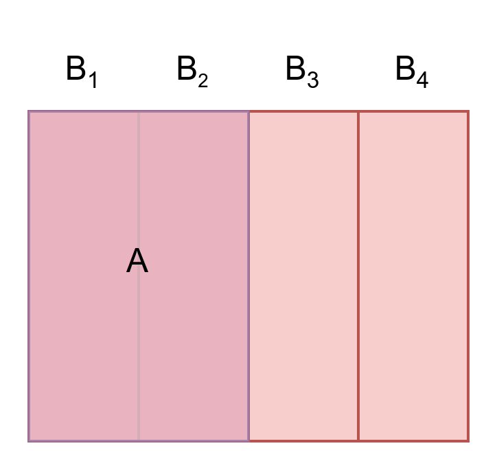

# **Law of Total Probability**

Given $B_1, B_2, B_3, \cdots$ be a partition of $\Omega$, so that $\Omega = \bigcup_{i=1}^n B_i$. The total probability of an event $A$, donated by $P(A)$, can be found by summing the probabilities over each part of the partition. This is analogous to finding the total area of a country by summing the areas of its provinces.

$$
P(A) = \sum_{i=1}^n P(A \cap B_i) = \sum_{i=1}^n P(A|B_i)P(B_i)
$$

{++Proof++}

Since $B_i$ is a partition of $\Omega$, we have

$$
\Omega = \bigcup_{i=1}^n B_i \\
\begin{align*}
A &= A \cap \Omega\\
&= A \cap \left(\bigcup_i B_i \right)\\
&=\bigcup_i(A \cap B_i)
\end{align*}
$$

By the third axiom of probability (additivity),

$$
\begin{align*}
P(A) &= P\left(\bigcup_i(A \cap B_i)\right) \\
&= \sum_i P(A\cap B_i) \\
&= \sum_i P(A|B_i)P(B_i)
\end{align*}\\
$$

To make this more intuitive, let’s consider an illustration from Steve's video.
<figure markdown="span">
{width="300"}
</figure>
Based on the illustration, we have

$$
P(A) = P(A \cap B) + P(A \cap B^c)
$$

Using the definition of conditional probability, this equation becomes

$$
P(A) = P(A|B)P(B) + P(A|B^c)P(B^c)
$$

This is easier to understand intuitively. Since $A$ overlap with $B_1$ and $B_2$, it means $A \cap B$. Where the entire left area of $B$ is $B^c$, so the total area of left area is $A \cap B^c$.
