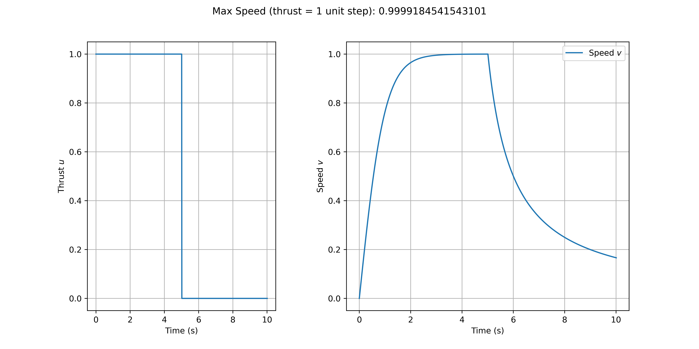
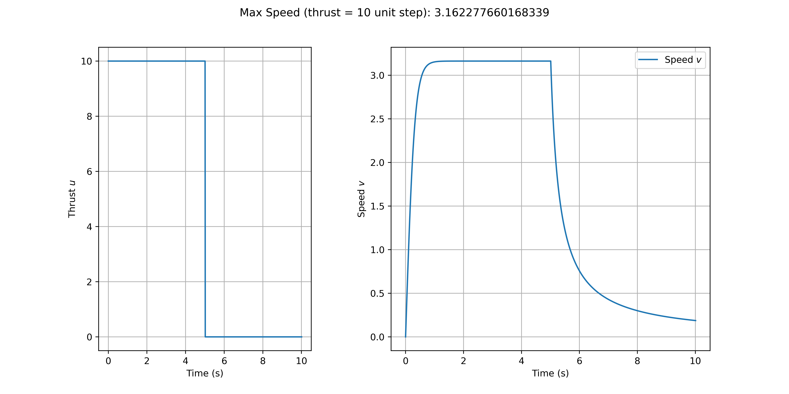
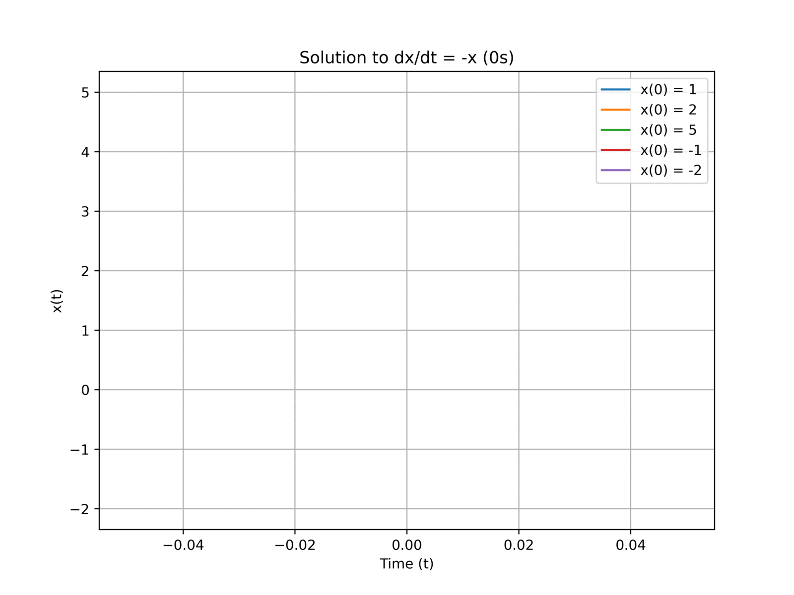
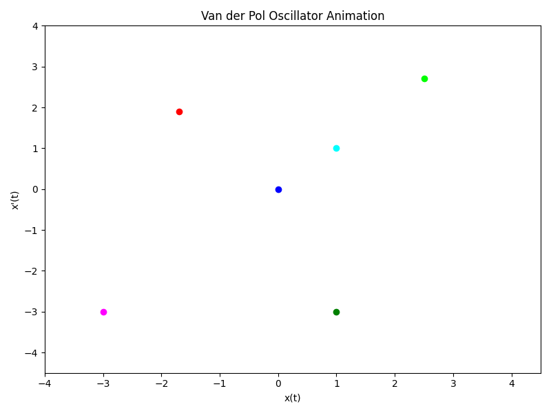
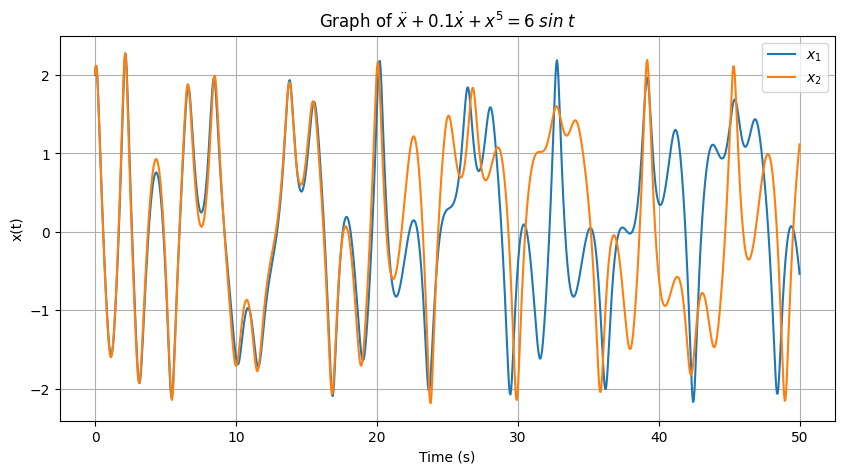

# **Introduction to Nonlinear Systems**

Nonlinear control often involves an iterative process in the analysis and design of its systems.

## **Why Nonlinear Control?**
1. **Improvement of Existing Control Systems**
    - **Linear Control** : It can only work on small changes in the stable point to keep the linear system valid. Large changes in the system make it unstable because the nonlinearity in the system cannot be controlled by a linear model.
    - **Nonlinear Control** : It can operate on significant changes around the stable point.

2.  **Hard Nonlinearities**
    
    In **Linear Control**, the system model must be able to determine its linear function. However, in general, control systems have a discontinuous nature. This means that the system will experience a sudden change in state. This is what is called ***hard nonlinearities***.

3.  **Dealing with Model Uncertainties**
    
    In the linear model, the system parameters are completely known. However, in fact, in the case of a control system, there is uncertainty in the parameters used in the system. Linear Control uses exact values for its parameters without considering measurement uncertainty, which can result in a decrease in the level of stability or even become unstable.

4. **Simplicity**
    
    System models with nonlinearity are based on physical principles by modeling controlled processes. This is because the system to be controlled exhibits nonlinear characteristics related to the underlying physical principles.

## **Nonlinear System Behaviour**

**Nonlinear Control** systems can be described in differential equations. If the system operates within small variations and the role of uncertainty is not too large, then the system can be estimated with a linear model.

### **Nonlinearities**
- Inherent (Natural): uncertainty of the *hardware* or *motion* of the system
- Intentional (Artificial): uncertainty that is deliberately introduced into the control system

### **Linear Systems**
Linear Time Invariant (LTI) :

$$\dot x = Ax \\
\text{x = vector state} \\
\text{A = coefficent matrix of system}$$

Properties of LTI (Linear Time-Invariant) Systems:

1. The system has an equilibrium point if the matrix *A* is nonsingular (determinant value $\neq$ 0).

2. The equilibrium point is stable if all eigenvalues of matrix *A* are negative real numbers.

3. The transient response consists of the natural modes of the system. Transient response refers to the system's response to initial changes or disturbances. Natural modes are the patterns of vibration or oscillation that naturally arise from the system.

4. Adding an external input $u(t)$ to the LTI equation results in:

$$
\dot x = Ax + Bu
$$

- The response of the LTI system satisfies the principle of superposition.
- If the system input is bounded, then the output of the system is also bounded.
- If the system input is a sinusoidal wave, then the output will also be a sinusoidal wave.

### **Superposition Principle**
A system can satisfy the superposition principle if the system can exist in multiple states at any given time, and the state of the system at that time is the result of a linear combination of individual states.

$$F(x_1 + x_2) = F(x_1) + F(x_2)\\
\text{and}\\
F(ax) = aF(x),\;a \;\text{is scalar}$$

### **An Example Of Nonlinear System Behaviour**
Model for *Underwater Vehicle*

$$\dot v + |v|v = u\\
\dot v = u - |v|v\\
\text{u = thrust on the propeller}\\
\text{v = velocity of the R.O.V (remotely-operated underwater vehicle)}$$

The equation $|v|v$ represents the nonlinearity of the system. This equation states that the change in velocity $\dot v$ depends on the control parameter $u$ and the quadratic term of the R.O.V velocity $|v|v$, also known as the **DRAG FORCE** $F_D \propto v^2$.

**DRAG FORCE** is the force that acts in the opposite direction to the relative motion of an object with respect to the surrounding fluid.

Below is an experiment using the **First-Order Euler Method**:

$$
y_{i+1} = y_i + \Delta t \cdot f(t_i, y_i);\quad \text{given}\;t_0, \; y_0 \\
y_{i+1} = \text{output at the next time step}\;(i+1) \\
y_{i} = \text{output at time}\;i \\
\Delta t = \text{time step} \\
f(t_i, y_i) = \text{function determining the rate of change of y w.r.t t}
$$

<figure markdown="span">
{width="800"}
</figure>
<figure markdown="span">
{width="800"}
</figure>

In both graphs above, the system demonstrates that at high velocities, the coefficient of the "drag effect" produced by $|v|$ becomes larger, causing the system to reach equilibrium faster compared to when no thrust *u* is applied (or when $t > 5\;s$), which takes longer to reach a velocity of 0.

In the second graph, the thrust is increased tenfold. As mentioned earlier, at high velocities, the system will reach equilibrium faster compared to low velocities. However, when the thrust is increased tenfold from the first experiment where thrust = 1 unit step, the equilibrium velocity $v_s$ is not ten times larger than in the first experiment.

Nonlinear systems tend to exhibit more complex responses to large input changes and do not scale linearly as in linear systems. Changes in control *u* can trigger significant nonlinear effects on the system's response.

$$
u=1 => 0 + |v_s|v_s = 1 => v_s = 1\\
u=10 => 0 + |v_s|v_s = 10 => v_s = \sqrt{10} \approx 3.16
$$

## **Some Common Nonlinear Systems Behaviours**
### **Multiple Equilibrium Points**
   Equilibrium Point is a condition where the system undergoes no change over time.
   
*Example :*
​
In a nonlinear system $\dot x = f(x)$, where $f(x)$ is a nonlinear function.

$$\dot x = -x + x^2$$

Linearizing $\dot x$ around $\dot x = 0$:

$$ 0 = -x + x^2\\
\text{Obtained 2 equilibrium points : }\\
\bar x = 0 \quad \text{and} \quad \bar x = 1$$

For the linear system ($\dot x = Ax$), we can obtain a linear system from the nonlinear system using **First Order Taylor Expansion**:
​
$\text{Taylor Expansion : }$

$$f(x) = f(\bar x) + f'(\bar x) (x-\bar x)+\frac {1}{2!}f''(\bar x)(x-\bar x)^2 + ...$$

So,

$$f(x) = -x+x^2\\
f'(x)=-1+2x$$

If $\bar x = 0$, then:

$$f(0) = -(0) + 0^2 = 0\\
f'(0)=-1+2(0) = -1\\
f(x) = f(0) + f'(0) (x-0)\\
f(x) = 0 + -1(x-0)\\
f(x)=-x$$

Thus obtained:

$$\dot x =  -x$$

The solution to the above linear equation is:

$$\dot x = -x\\
\frac{dx}{dt} = -x\\
\frac{1}{x}\;dx = - dt\\
\int \frac{1}{x}\;dx = \int -1\;dt$\\
\ln|x|=-t+C$$

If $x(0)=x_0$, then

$$\ln|x_0|=0+C\\
\ln|x_0|=C$$

Substitute $C$ into the equation $\ln|x|=-t+C$,

$$\ln|x|=-t+\ln|x_0|\\
\ln|x|-\ln|x_0|=-t\\
\ln \left|\frac{x}{x_0}\right| = -t\\
\frac{x}{x_0} = \pm e^{-t}$$

so,

$$x(t) = x_0e^{-t}$$

<figure markdown="span">
{width="800"}
</figure>

If we directly use the response from the equation $\dot x = -x+x^2$, then:

$$\frac {dx}{-x+x^2} = dt\\
-\frac {dx}{x(1-x)}= dt\\
\int \frac {dx}{x(1-x)} = \int-1 dt\\
\ln |x| - \ln|1-x| = -t +C\\
\ln \left|\frac{x}{1-x}\right|=-t+C\\
\frac{x}{1-x} = \pm e^{-t+C}$$

If $x(0) = x_0$, then

$$\frac{x_0}{1-x_0} = \pm e^{C}\\
\ln \left|\frac{x_0}{1-x_0}\right| = C$$

Substitute the value of $C$ into $\frac{x}{1-x} = \pm e^{-t+C}$

$$\frac{x}{1-x}=e^{-t+\ln \left|\frac{x_0}{1-x_0}\right|}\\
\frac{x}{1-x}=e^{-t} \cdot \left(\frac{x_0}{1-x_0}\right)\\
x=e^{-t} \cdot (1-x) \cdot \left(\frac{x_0}{1-x_0}\right)\\
x\cdot(1-x_0)=e^{-t} \cdot (1-x) \cdot x_0\\
x\cdot(1-x_0)=e^{-t}\cdot x_0 - e^{-t}\cdot x \cdot x_0\\
x\left(1-x_0\right)+e^{-t}\cdot x\cdot x_0=e^{-t}x_0\\
x\left(1-x_0+e^{-t}\cdot x_0\right)=e^{-t}x_0$$

thus obtained,

$$x(t)=\frac{x_0e^{-t}}{1-x_0+x_0e^{-t}}$$

<figure markdown="span">
{width="800"}
</figure>

In the graph of the linearized system $x(t)=x_0e^{-t}$, regardless of its initial conditions, the system will eventually reach a stable state ($x = 0$) over time.

In the graph of the nonlinear system without linearization $x(t)=\frac{x_0e^{-t}}{1-x_0+x_0e^{-t}}$, it can be observed that at time step 1, the system with an initial condition $< 1$ will reach the equilibrium point $x = 0$, but for initial conditions $> 1$, the state $x$ will tend towards infinity in a finite time, which is known as a ***finite escape time***.

The experiment above concludes that stability in nonlinear systems depends on their initial conditions.

## **Limit Cycles**

**Limit Cycles** are isolated closed trajectories that form periodic and regular motion over time. "Isolated" means that the trajectory does not intersect with other trajectories, and "closed" means that the trajectory is a closed path.

**Example:**

The Van der Pol Oscillator Equation is a second-order ordinary differential equation that models the oscillation of an electrical circuit in a vacuum tube. The Van der Pol equation is a non-conservative model, meaning that the system modeled can gain or lose energy over time.
$$\ddot x + \mu (1-x^2) \dot x + x = 0$$
where:
- $x$: initial condition coordinate
- $\mu$: damping strength (non-linearity)

**Liénard Theorem** can prove that the Van der Pol equation has Limit Cycles.

**Liénard Equation:**

$$\frac{d^2}{dt^2}x + F(x)\frac{d}{dt}x+G(x) = 0 $$

**Liénard Theorem:**

1. $F$ and $G$ are continuous functions and their derivatives are also continuous $f,g \in C^1(\mathbb R)$

2. $G$ is an odd function, i.e., $G(-x)=-G(x)$

3. $G(x) > 0$, for $x > 0$

4. $F$ is an even function, i.e., $F(-x)=F(x)$

5. $F(x)=\int _0^x f(x)\;dx$, and
    - $F(x) < 0$ for $0<x<a$
    - $F(x) > 0$ for $x>a$
    - $F(0) = F(\pm a) = 0$

If the *Liénard Equation* satisfies these theorems, then the equation has a **Stable Limit Cycle** surrounding the origin point. The Van der Pol equation is an example of a *Liénard Equation*.

Applying the *Liénard Theorem* to the *Van der Pol Oscillator Equation* with $\mu > 0$:

Based on the *Liénard Equation*:

$$F(x) = \mu (1-x^2)\\
G(x) = x$$

1. $F$ and $G$ belong to the class $C^1$ (continuously differentiable)

2. $G(-x)=-x$ so $G(x)$ is an odd function

3. $G(x) > 0$ if $x > 0$

4. $F(-x) = \mu (1-(-x)^2) = \mu (1-x^2) = F(x)$, so $F(x)$ is an even function

5. $F(x) = \mu \int _0 ^x (1-x^2)\;dx = \mu (x-\frac{1}{3}x^3)$,

thus, roots are obtained as $x=0, x=-\sqrt 3, x=\sqrt 3$

- $F(x) = \mu (x-\frac{1}{3}x^3) < 0$ for $0<x<\sqrt 3$

- $F(x) = \mu (x-\frac{1}{3}x^3) > 0$ for $x>\sqrt 3$

- $F(0) = F\left(-\sqrt 3\right) = F\left(\sqrt 3\right) = 0 $

The *Van der Pol Equation* **satisfies** all the Liénard theorem, so it can be concluded that the Van der Pol equation has a **Stable Limit Cycle** surrounding the origin.

The Van der Pol equation can be written in 2 sets of *First-Order ODE* (*state space system*) with $y = \dot x$, thus

$$\dot x = y\\
\dot y = \ddot x = -x + \mu (1-x^2)y$$

The *state space system* equation is visualized in the code below.

<figure markdown="span">
{width="800"}
</figure>

In the animation of the Van der Pol equation, there are **limit cycles** surrounding the origin point (0, 0) (equilibrium point).

When the state has a small value, the damping factor $\mu(1-x^2)$ increases, causing the oscillation's amplitude to approach the **limit cycles**. Conversely, when the state has a large value, the damping factor decreases, causing the oscillation's amplitude to decrease until the state is around the **limit cycles**.

This phenomenon occurs when the damping constant $\mu > 0$. When $\mu = 0$, the Van der Pol equation becomes the equation of Simple Harmonic Motion $\ddot x + x =0$ (i.e., sine and cosine functions), and it becomes a linear equation (no **limit cycles**).

## **Bifurcations**

*Bifurcations* are situations where small changes in the parameters of a system result in changes in the behavior (qualitative properties) of the system. *Bifurcation values* are the values of the system parameters that cause the system to transition from one type of behavior to another, such as from stability to another stability or to instability.

**Example:**

The undamped Duffing equation is a second-order ordinary differential equation given by:

$$\ddot x + \alpha x + x^3 = 0$$

where $\alpha$ is a changing parameter.

Let $\dot x = y$, then

$$\begin{cases}
\dot{x} = y \\
\dot{y} = -\alpha x - x^3
\end{cases}
$$

The fixed points of this equation are obtained when $\dot{x} = 0$ and $\dot y=0$, resulting in

$$\dot x = y\\
y = 0\\
\dot{y} = -\alpha x - x^3\\
-\alpha x - x^3 = 0\\
-x(\alpha + x^2) = 0\\
-x=0\\
x_1 = 0$$

Next, we find the fixed points when $\alpha > 0, \alpha = 0,$ and $\alpha < 0$,

When $\alpha > 0$,

$$\alpha + x^2 = 0\\
x^2=-\alpha\\
x_2 = i\sqrt \alpha, x_3 = -i\sqrt \alpha$$

Since $\alpha + x^2$ cannot be factored using real numbers, there is only 1 fixed point when $\alpha > 0$, which is $x_1 = 0$.

When $\alpha = 0$,

$$\alpha + x^2 = 0\\
x^2=0\\
x_1 = 0$$

The fixed point obtained is $x_1 = 0$.

When $\alpha < 0$,

$$\alpha + x^2 = 0\\
x^2=-(-\alpha)\\
x_2 = \sqrt {-\alpha}, x_3 = -\sqrt {-\alpha}$$

Thus, 3 fixed points are obtained,

$$ p_1 (0, 0) \text{ for all values of} \; \alpha\\
 p_{2,3} \left( \pm\sqrt{-\alpha}, 0 \right) \text{for} \; \alpha < 0$$

The Jacobian of 2 set first-order ODE undamped Duffing equation with $f(x,y)=(\dot x, \dot y)$ is:

$$
\mathbb J(f(x,y))=\begin{bmatrix}
\frac{\partial \dot{x}}{\partial x} & \frac{\partial \dot{y}}{\partial x} \\
\frac{\partial \dot{x}}{\partial y} & \frac{\partial \dot{y}}{\partial y}
\end{bmatrix} = \begin{bmatrix}
0 & 1 \\
-a-3x^2 & 0
\end{bmatrix}
$$

$$
\mathbb J_{(0,0)}= \begin{bmatrix}
0 & 1 \\
-a & 0
\end{bmatrix}\\
\text {Tr } \mathbb J_{(0,0)} = 0\\
\det \mathbb J_{(0,0)} = a\\
\mathbb J_{\left(\sqrt{-\alpha},0\right)}= \begin{bmatrix}
0 & 1 \\
2a & 0
\end{bmatrix}
\\
\text {Tr } \mathbb J_{\left(\sqrt{-\alpha},0\right)} = 0\\
\det \mathbb J_{\left(\sqrt{-\alpha},0\right)} = -2a\\
\mathbb J_{\left(-\sqrt{-\alpha},0\right)}= \begin{bmatrix}
0 & 1 \\
2a & 0
\end{bmatrix}\\
\text {Tr } \mathbb J_{\left(-\sqrt{-\alpha},0\right)} = 0\\
\det \mathbb J_{\left(-\sqrt{-\alpha},0\right)} = -2a\\
p_1(0,0)\text{ stable for }a<0\text{ and unstable for }a>0\\
p_{2,3} \left( \pm\sqrt{-\alpha}, 0 \right)\text{ unstable for }a<0$$

<figure markdown="span">
{width="800"}
</figure>

## **Chaos**

*Chaos*, also known as the *butterfly effect*, is a phenomenon where nonlinear systems are sensitive to initial conditions. Small changes in initial conditions can lead to significant differences in the long-term behavior of the system, or in other words, initial conditions will diverge significantly from the final state.

*Example:*

$$\ddot x + 0.1\dot x + x^5 = 6 \sin t$$

With initial conditions:
- For $x_1(0) = 2$ and $\dot{x}_1(0) = 3$
- For $x_2(0) = 2.01$ and $\dot{x}_2(0) = 3.01$

In this example, even a small difference in the initial conditions ($x_1$ and $x_2$) leads to vastly different trajectories over time. This illustrates the sensitivity of chaotic systems to initial conditions, where tiny differences can lead to divergent behaviors.

<figure markdown="span">
{width="800"}
</figure>

In the graph, it is evident that the plot of the initial condition $x_1$ over time and the initial condition $x_2$ over time exhibit only slight differences in the values of $x$ for $t<\pm21 \;s$. However, for $t>\pm 21\;s$, the system displays chaotic behavior, and the values of $x(t)$ for both initial conditions diverge significantly.

!!! info
    Most of this section are my notes from <a href = "https://www.amazon.com/Applied-Nonlinear-Control-Jean-Jacques-Slotine/dp/0130408905">Applied Nonlinear Systems by Jean-Jacques Slotine and Weiping Li </a>.
