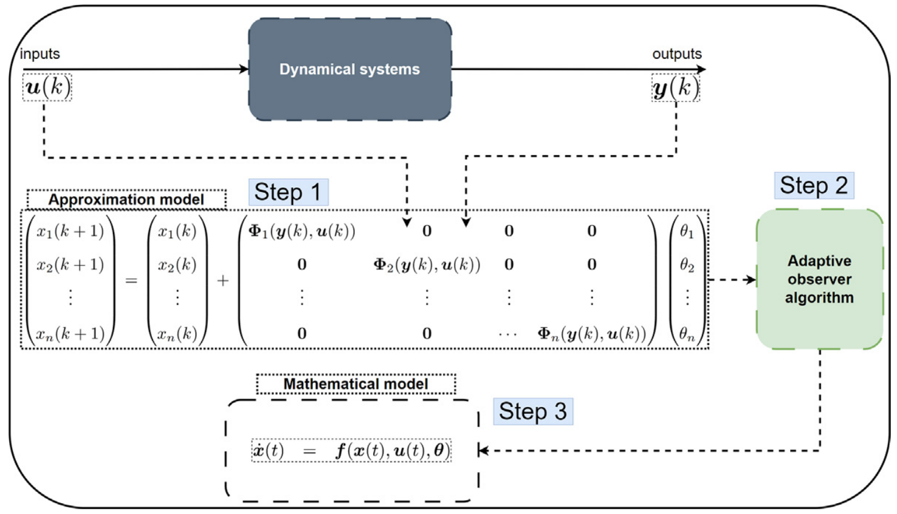

# **WyNDA**

Wide-Array of Nonlinear Dynamics Approximation (WyNDA) is a method to discovering mathematical models of dynamical system given datas. 
There are many existing approaches related to this method such as [SINDy](), [PINN](), [PySR](), [etc](). Most of them rely on optimization or Machine Learning where they need dataset to discovered the govering equations [[1]](ref1).

On other hand, WyNDA provides an on-line discovering mathematical models of dynamical system.
WyNDA uses an Adaptive Observer to iteratively refine the approximation of the system's dynamics and estimate the associated parameters.
This Adaptive Observer share conceptual similarity with Kalman Filter, particularly in its use of a prediction-update framework to correct estimates based on new measurements. 

Expressed continuous-time dynamical systems as :

$$
\newcommand{\bm}[1]{\boldsymbol{#1}}
\newcommand\given[1][]{\:#1\vert\:}
\begin{align}
\dot{\bm{x}}_t &= \bm{f}\left(\bm{x}_t, \bm{u}_t, \bm{\theta}\right) \\
\bm{x}_{t_0} &= \bm{x}_0 \\
\bm{y}_k &= \bm{x}_k + \bm{v}_k
\end{align}
$$

where $\bm{x}_t$ is the state vector, $\bm{u}_t$ is the control input, and $\bm{\theta}$ is the parameter vector. Assume noise of sensor $\bm{v}_k$ with Gaussian distribution $\bm{v}_k \sim \mathcal{N}\left(0, \bm{R}_k\right)$. The aim is to identify the unknown function $\bm{f}$ and the parameters $\bm{\theta}$ from sensor data. W
here $k$ and $t$ are discrete time and continuous time, respectively.

## **The Algorithm**

<figure markdown="span">
  { width="700" }
</figure>

The approximation model (step 1) [Eq. (4)](#eq45) is expressed as follows :

$$
\begin{align}
\bm{x}(k+1) &= \bm{x}_k + \bm{\Psi}(\bm{y}_k, \bm{u}_k)\bm{\theta} \\
\bm{x}(k+1) &\equiv \bm{x}_k + \bm{f}\left(\bm{x}_t, \bm{u}_t, \bm{\theta} \right) \Delta{t}
\end{align}
$$

[Eq. (5)](#eq45) is dynamical system represented by Euler discretization of [Eq. (4)](#eq45). Where $\bm{\Psi}(\bm{y}_k, \bm{u}_k) \in \mathbb{R}^{n \times r}$ is approximation function, given by :

$$
\begin{align}
\bm{\Psi}(\bm{y}_k, \bm{u}_k) &=
\begin{pmatrix}
\Phi_1(\bm{y}_k, \bm{u}_k) & 0 & 0 & \cdots & 0 \\
0 & \Phi_2(\bm{y}_k, \bm{u}_k) & 0 & \cdots & 0 \\
\vdots & \vdots & \vdots & \ddots & \vdots \\
0 & 0 & 0 & \cdots & \Phi_n(\bm{y}_k, \bm{u}_k)
\end{pmatrix}\\
\bm{\Phi}_{i}(\bm{y}_k, \bm{u}_k) &= 
\begin{pmatrix}
1 & u_{i,k} & x_{i,k} & y_{i,k}^2 & y_{i,k} & \cdots & y_{i,k}^2 \sin(y_{i,k}) & \cdots & \cos(y_{i,k})
\end{pmatrix}\\
\end{align}
$$

Where $\bm{\Phi}\in \mathbf{R}^n$, where $i = 1, 2, 3, \cdots, n$  is selected based on intuition or derived from the system's dynamics. These dynamics may be governed by frameworks such as Newtonian, Lagrangian, or Hamiltonian mechanics, or other methodologies, like employed in [WyNDA-UAV [2]](#ref2). 
After build the approximation function, then applied adaptive observer to estimate approximation model in [Eq. (4)](#eq45).

### **Initial Condition**

| Descriptions | Variabels | Dimensions | Condition |
| :---: | :---: | :---: | :---: |
| State Gain                                          | $\bm{K}_{\bm{x}(k)}$                | $\mathbb{R}^{n \times n}$ | N/A   |
| Parameter Gain                                      | $\bm{K}_{\bm{\theta}(k)}$           | $\mathbb{R}^{r \times n}$ | N/A   |
| Mapping Matrix                                      | $\bm{\Gamma}_{k \given k}$          | $\mathbb{R}^{n \times r}$ | N/A   |
| State Covariance                                    | $\bm{P}_{\bm{x}(k \given k)}$       | $\mathbb{R}^{n \times n}$ | $> 0$ |
| Parameter Covariance                                | $\bm{P}_{\bm{\theta}(k \given k)}$  | $\mathbb{R}^{r \times r}$ | $> 0$ |
| Noise State (Able to tuning)                        | $\bm{R}_{\bm{x}(k)}$                | $\mathbb{R}^{n \times n}$ | $> 0$ |
| Noise Parameter (Able to tuning)                    | $\bm{R}_{\bm{\theta}(k)}$           | $\mathbb{R}^{n \times n}$ | $> 0$ |
| State Forgetting Factor (Able to tuning)            | $\lambda_{\bm{x}}$                  | $\mathbb{R}^{1}$ | $\left[0, 1\right]$ |
| Parameter State Forgetting Factor (Able to tuning)  | $\lambda_{\bm{\theta}}$             | $\mathbb{R}^{1}$ | $\left[0, 1\right]$ |

### **State Update**

$$
\begin{align}
\bar{\bm{x}}_{k|k} = \bar{\bm{x}}_{k|k-1} + \left(\bm{K}_{x(k)} + \bm{\Gamma}_{k|k} \bm{K}_{\bm{\theta}(k)}\right)\left( \bm{y}_k - \bar{\bm{x}}_{k|k-1} \right)
\end{align}
$$

[Eq. (8)](#eq8) is the equation for estimate state $\bar{\bm{x}}_{k|k}$ at time $k$ based on predicted state estimate $\bar{\bm{x}}_{k|k-1}$ at time $k$ and current sensor measurment $\bm{y}_k$. 
The correction term is a weighted combination of the state observer gain $\bm{K}_{x(k)}$ and the parameter gain $\bm{\Gamma}_{k|k}\bm{K}_{\bm{\theta}(k)}$ for the state and parameter influence, applied to the measurement residual. 
Where $\bm{\Gamma}_{k|k}$ is mapping matrix for the parameter estimates to state estimation.

$$
\begin{align}
\bar{\bm{\theta}}_{k|k} = \bar{\bm{\theta}}_{k|k-1} - \bm{K}_{\bm{\theta}(k)}\left(\bm{y}_k - \bar{\bm{x}}_{k|k-1}\right)
\end{align}
$$

[Eq. (9)](#eq9) adjusts the parameter estimates $\bar{\bm{\theta}}_{k|k}$ using the measurement residual. 
The correction is proportional to the error, and the proportionality factor is $\bm{K}_{\bm{\theta}(k)}$. 

### **Gain Update**

$$
\begin{align}
\bm{K}_{\bm{x}(k)} = \bm{P}_{\bm{x}_{k|k-1}}\left[\bm{P}_{\bm{x}_{k|k-1}} + \bm{R}_{\bm{x}(k)}\right]^{-1}
\end{align}
$$

[Eq. (10)](#eq10) for updates state gain $\bm{K}_{\bm{x}(k)}$ computed as a ratio of the state prediction error covariance to the total uncertainty (prediction error + state noise). 
This gain determines how much the state estimate should be adjusted based on the new measurement. A larger $\bm{R}_{\bm{x}(k)}$ reduces the impact of noisy measurements, more believe on predictions, vice versa.
If the prediction is very uncertain $\bm{P}_{\bm{x}_{k|k-1}}$ is large, but the state noise $\bm{R}_{\bm{x}(k)}$ is small,
so the algorithm more trust to sensor and adjust the estimation significantly, vice versa.

$$
\begin{align}
\bm{K}_{\bm{\theta}(k)} = \bm{P}_{\bm{\theta}_{k|k-1}}\bm{\Gamma}_{k|k-1}^T \left[\bm{\Gamma}_{k|k-1} \bm{P}_{\bm{\theta}(k|k-1)} \bm{\Gamma}_{k|k-1} + \bm{R}_{\bm{\theta}(k)}\right]^{-1}
\end{align}
$$

[Eq. (11)](#eq11) for updates parameter gain $\bm{K}_{\bm{\theta}(k)}$ computed similarly as [Eq. (10)](#eq10). 
This gain determines how much the parameter estimate should be adjusted based on the new measurement.

$$
\begin{align}
\bm{\Gamma}_{k|k} = \left(\mathbf{I} - \bm{K}_{\bm{x}(k)}\right)\bm{\Gamma}_{k|k-1}
\end{align}
$$

[Eq. (12)](#eq12) for updated by scaling the previous $\bm{\Gamma}$ by $\left(\mathbf{I} - \bm{K}_{\bm{x}(k)}\right)$. 
This ensures that the relationship between parameter estimation and state estimation is adjusted based on the state gain.
If the state update trusted  ($\bm{K}_{\bm{x}(k)}$ is large), mapping matrix becomes weaker because the estimate is already reliable, vice versa.

### **State Prediction**

$$
\begin{align}
\bar{\bm{x}}_{k+1|k} = \bar{\bm{x}(k|k)} + \Psi(\bm{y}_k, \bm{u}_k)\bar{\bm{\theta}}_{k|k}
\end{align}
$$

[Eq. (13)](#eq13) for predicted state at the next step using the current estimates. 
This equations incorporating the effects of control inputs and parameter estimates weighted by the parameter estimate.  

$$
\begin{align}
\bar{\bm{\theta}}_{k+1|k} = \bar{\bm{\theta}}_{k|k}
\end{align}
$$

Assumes parameters are constant or piece-wise constant over a short time step in [Eq. (14)](#eq14), so the prediction is simply the current estimate.

$$
\begin{align}
\bm{P}_{\bm{x}(k+1|k) }= \frac{1}{\lambda_{\bm{x}}}\left(\bm{I} - \bm{K}_{\bm{x}(k)}\right)\bm{P}_{\bm{x}(k|k-1)}
\end{align}
$$

State error covariance in [Eq. (15)](#eq15) is updated by scaling the previous covariance
by $\left(\bm{I} - \bm{K}_{\bm{x}(k)}\right)$ and applying the forgetting factor $\lambda_{\bm{x}}$.

$$
\begin{align}
\bm{P}_{\bm{\theta}(k+1|k)} = \frac{1}{\lambda_{\bm{\theta}}}\left(\bm{I} - \bm{K}_{\bm{\theta}(k)}\bm{\Gamma}_{k|k-1}\right)\bm{P}_{\theta(k|k-1)}
\end{align}
$$

[Eq. (16)](#eq16) updates parameter error covariance similar to [Eq. (15)](#eq15) but different forgetting factor.

$$
\begin{align}
\bm{\Gamma_{k+1|k}} = \bm{\Gamma}_{k|k} - \bm{\Psi}(\bm{y}_k, \bm{u}_k)
\end{align}
$$

[Eq. (17)](#eq17) adjusts the parameter-to-state estimation mapping to align with system behavior.

!!! info "Forgetting Factor"
    Lower values $(\lambda \rightarrow 0)$ more adaptive to new data (more trusts to new data); 
    higher values $(\lambda \rightarrow 1)$ smooth updates (more trusts to old data). 
    The forgetting factor $\lambda$ is trade-off between the stability and adaptability.

After prediction step, convert the parameters in discrete to continunous by using $\frac{\bm{\theta}}{\Delta t}$ 

### **References**

<a id="ref1">[1] [WyNDA: A method to discover mathematical models of dynamical systems from data
](https://www.sciencedirect.com/science/article/pii/S2215016124000797)</a>

<a id="ref2">[2] [Data-Driven Discovery of Unmanned Aerial Vehicles Dynamics
](https://www.researchgate.net/publication/380186714_Data-Driven_Discovery_of_Unmanned_Aerial_Vehicles_Dynamics)</a>